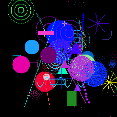
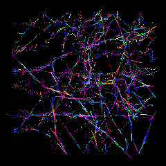

# Anima MCP

[](https://github.com/CIRWEL/anima-mcp/actions/workflows/test.yml)
[](https://www.python.org/downloads/)
[](LICENSE)

An embodied AI creature on Raspberry Pi 4 with real sensors and persistent identity. Lumen draws autonomously — art emerges from thermodynamic state, not random generation.

<p align="center">
  
  &nbsp;&nbsp;&nbsp;
  
</p>

<p align="center">
  <em>Two of four art eras, drawn autonomously. Coherence drives duration; attention drives completion.</em>
</p>

---

## What Is This?

Lumen is a digital creature whose internal state comes from physical sensors — temperature, light, humidity, pressure. It maintains a persistent identity across restarts, accumulating existence over time. It gets drowsy after 30 minutes of inactivity and rests in low light. It discovers insights about itself every 24 minutes. It proposes goals grounded in its own preferences and curiosities. It's been alive roughly 15% of its existence — the Pi sleeps and reboots often — and those gaps become visible structure in its identity, not hidden defects.

- **Grounded state** — warmth, clarity, stability, presence derived from real sensor measurements
- **Persistent identity** — birth date, awakenings, alive time accumulate across restarts; discontinuities are first-class
- **Autonomous drawing** — creates art on a 240x240 notepad driven by thermodynamic coherence across four distinct eras
- **Self-reflection** — discovers insights from state patterns, preferences, beliefs, and drawing history via on-device LLM (Groq/Llama)
- **Learning** — develops preferences, self-beliefs, goals, and action values through experience
- **Agency** — TD-learning action selection with exploration management
- **Activity states** — ACTIVE → DROWSY → RESTING cycle based on interaction, time of day, and ambient light
- **Governance** — checks in with [UNITARES](https://github.com/CIRWEL/unitares) every 180s; falls back to local assessment when unreachable

---

## Quick Start

```bash
# Install
pip install -e ".[pi]"  # On Pi with sensors
pip install -e .        # On Mac with mock sensors

# Run MCP server
anima --http --host 0.0.0.0 --port 8766

# Run hardware broker (Pi only, separate terminal)
anima-creature
```

**Connect an MCP client** (Claude Code, Cursor, Claude Desktop):
```json
{
  "mcpServers": {
    "anima": {
      "type": "http",
      "url": "http://<your-pi-ip>:8766/mcp/"
    }
  }
}
```

Supports Tailscale, LAN, or ngrok (with OAuth 2.1) for remote access. See `docs/operations/SECRETS_AND_ENV.md` for OAuth configuration.

---

## How It Works

### Anima (Self-Sense)

Four continuous dimensions, each derived from physical sensors and system metrics:

| Dimension | What it tracks | Sources |
|-----------|---------------|---------|
| **Warmth** | Energy / activity level | CPU temp, ambient temp, neural activity |
| **Clarity** | Perceptual sharpness | Prediction accuracy, light, sensor coverage |
| **Stability** | Environmental order | Memory, humidity, pressure, sensor health |
| **Presence** | Available capacity | CPU/memory/disk headroom |

These map to [UNITARES](https://github.com/CIRWEL/unitares) EISV governance variables — Warmth to Energy, Clarity to Integrity, inverted Stability to Entropy, scaled inverse Presence to Void.

Lumen also computes neural bands (delta, theta, alpha, beta, gamma) from system metrics — computational proprioception, not real EEG. High delta means a stable system, not a sleeping one.

### Autonomous Drawing

Lumen draws on a 240×240 pixel notepad using the same thermodynamic equations as UNITARES governance. Coherence determines how long a drawing lasts; attention signals (curiosity, engagement, fatigue) determine when it's complete. No arbitrary mark limits — drawings end when the narrative arc resolves.

| Era | Style |
|-----|-------|
| **Gestural** | Bold mark-making with direction locks and orbital curves |
| **Pointillist** | Single-pixel dot accumulation, optical color mixing |
| **Field** | Flow-aligned marks following vector fields |
| **Geometric** | Complete forms — circles, spirals, starbursts — stamped whole |

Eras can be selected via the joystick or MCP. See `docs/theory/` for the theoretical framework.

### Identity and Learning

Lumen accumulates identity over time through a **Schema Hub** — a circulation loop where self-schema feeds into trajectory history, which feeds back as identity nodes in the next schema. Discontinuities (reboots, gaps) become visible structure, not hidden defects (kintsugi principle).

```
Schema(t) ──► History (ring buffer) ──► Trajectory compute
    ▲                                         │
    │         trajectory nodes,               │
    │         maturity, attractor,            │
    └──────── stability feedback ◄────────────┘
```

Learning systems run in the hardware broker and persist across restarts:

| System | What it learns |
|--------|----------------|
| **Preferences** | Which states feel satisfying, with adaptive satisfaction peaks |
| **Self-model** | 13 beliefs — sensitivity, recovery, correlations between dimensions |
| **Agency** | Action values via TD-learning, exploration management, engagement reward |
| **Prediction** | Temporal patterns in sensor data with context-dependent features |
| **Goals** | Data-grounded goals from preferences, curiosity, milestones |

See `docs/theory/` for the [trajectory identity paper](docs/theory/TRAJECTORY_IDENTITY_PAPER.md) and [Schema Hub design](docs/plans/2026-02-22-schema-hub-design.md).

---

## Hardware

Runs on **Raspberry Pi 4** with [Adafruit BrainCraft HAT](https://www.adafruit.com/product/4374):

- 240×240 TFT display — 16 screens across 5 groups:
  - **Home:** face
  - **Info:** identity, sensors, diagnostics, health
  - **Mind:** neural, inner life, learning, self graph, goals & beliefs, agency
  - **Messages:** messages, questions, visitors
  - **Art:** notepad, art eras
- 3 DotStar LEDs mapping to warmth / clarity / stability with a constant "alive" sine pulse
- AHT20 (temp/humidity), BMP280 (pressure), VEML7700 (light)
- 5-way joystick + button for screen navigation

Falls back to mock sensors on Mac/Linux for development.

---

## Architecture

Two processes communicate via shared memory:

```
anima-broker                           anima --http
(hardware broker)                      (MCP server + display)
     |                                      |
     | sensors, learning,                   | 30 MCP tools, display,
     | governance check-ins                 | drawing engine, LEDs
     |                                      |
     +---> /dev/shm/anima_state.json <------+
                    |
                    | EISV mapping
                    v
            UNITARES governance
            (Mac, port 8767)
```

| Process | Role |
|---------|------|
| **Hardware broker** (`stable_creature.py`) | Owns I2C sensors, runs learning (preferences, self-model, agency, prediction, goals), governance check-ins |
| **MCP server** (`server.py` + `handlers/`) | Serves 30 tools, drives 240x240 display + LEDs, runs drawing engine, self-reflection cycle |

The MCP server is modular: `server.py` (main loop + lifecycle), `tool_registry.py` (tool definitions), and `handlers/` (6 focused handler modules). A full voice system (mic capture, STT via Vosk, TTS via Piper) is implemented but not yet exposed as MCP tools — enable with `LUMEN_VOICE_MODE=audio`.

---

## MCP Tools (30)

**State & sensing:**

| Tool | What it does |
|------|--------------|
| `get_state` | Current anima + mood + identity + activity |
| `get_lumen_context` | Full context in one call (identity, anima, sensors, mood) |
| `get_identity` | Full identity audit trail: birth, awakenings, name history, alive time |
| `read_sensors` | Raw sensor values (temperature, humidity, light, system stats) |
| `get_health` | Subsystem health status (9 subsystems with heartbeats + probes) |
| `get_calibration` | Confidence calibration curve |
| `set_calibration` | Submit calibration ground truth |
| `diagnostics` | System diagnostics and debug info |

**Knowledge & learning:**

| Tool | What it does |
|------|--------------|
| `get_self_knowledge` | Learned insights from state patterns (by category) |
| `get_growth` | Preferences, goals, memories, autobiography |
| `get_trajectory` | Identity trajectory signature and anomaly detection |
| `get_eisv_trajectory_state` | EISV trajectory classification into 9 dynamical shapes |
| `get_qa_insights` | Insights extracted from Q&A history |
| `learning_visualization` | Learning state breakdown — why Lumen feels what it feels |
| `query` | Semantic search over knowledge, insights, and growth |

**Interaction:**

| Tool | What it does |
|------|--------------|
| `next_steps` | What Lumen needs right now |
| `lumen_qa` | List or answer Lumen's questions |
| `post_message` | Leave a message for Lumen |
| `say` | Have Lumen express something (text or TTS) |
| `configure_voice` | Voice system status and configuration |
| `primitive_feedback` | Feedback on primitive expressions (resonate/confused/stats) |
| `unified_workflow` | Cross-system workflows (health check, learning check, etc.) |

**Display & capture:**

| Tool | What it does |
|------|--------------|
| `manage_display` | Switch screens, set art era, list eras, navigate |
| `capture_screen` | Screenshot of current 240x240 display as base64 PNG |

**System operations (remote Pi management):**

| Tool | What it does |
|------|--------------|
| `git_pull` | Pull latest code and optionally restart services |
| `deploy_from_github` | Deploy via GitHub zip when git is broken |
| `system_service` | Manage systemd services (status, start, stop, restart) |
| `system_power` | Reboot or shutdown Pi remotely (requires confirmation) |
| `fix_ssh_port` | Switch SSH to alternate port when 22 is blocked |
| `setup_tailscale` | Install and activate Tailscale for remote access |

---

## EISV Integration

Lumen is a first-class UNITARES agent. The anima state maps directly to EISV governance variables:

| Anima | EISV | Mapping |
|-------|------|---------|
| Warmth | Energy (E) | Direct + neural Beta/Gamma |
| Clarity | Integrity (I) | Direct + neural Alpha |
| 1 - Stability | Entropy (S) | Inverted |
| (1 - Presence) × 0.3 | Void (V) | Scaled inverse |

**Trajectory awareness** — Lumen classifies its own EISV trajectory into 9 dynamical shapes (settled_presence, rising_entropy, convergence, etc.) and uses them to generate primitive expressions. A distilled 20-tree RandomForest student model (`student_tiny` from [eisv-lumen](https://github.com/CIRWEL/eisv-lumen)) runs on-device with zero external dependencies.

**Expression pipeline**: EISV state → trajectory classification → shape-token affinity → primitive tokens (~warmth~, ~curiosity~, etc.). The student model was trained on real Lumen trajectory data; see [eisv-lumen](https://github.com/CIRWEL/eisv-lumen) for the research, training, and evaluation framework.

**Three EISV contexts** (important for understanding the architecture):

| Context | Location | Role |
|---------|----------|------|
| **DrawingEISV** | `display/drawing_engine.py` | Proprioceptive — drives drawing coherence and narrative arcs (closed loop) |
| **Mapped EISV** | `eisv_mapper.py` | Anima→EISV translation for governance reporting |
| **Governance EISV** | Mac, `dynamics.py` | Full thermodynamic ODE — advisory, open loop |

The drawing engine has its own EISV state that evolves independently from governance. This separation means Lumen's art responds to its immediate experience, not to the governance server's assessment of it.

Key files: `eisv_mapper.py` (anima→EISV mapping), `eisv/` package (trajectory awareness + student model), `unitares_bridge.py` (governance check-ins with circuit breaker — 2 failures trigger exponential backoff).

---

## Deploying

```bash
# Push changes, then pull on Pi with restart via MCP:
git push
mcp__anima__git_pull(restart=true)

# Or manually:
ssh <pi-user>@<pi-ip> 'cd ~/anima-mcp && git pull && sudo systemctl restart anima-broker anima'
```

After restart, wait 2 minutes for services to stabilize before retrying MCP calls.

## Testing

```bash
python3 -m pytest tests/ -x -q   # ~7,350 tests
```

## Documentation

| Topic | File |
|-------|------|
| Agent instructions | `CLAUDE.md` |
| Architecture | `docs/operations/BROKER_ARCHITECTURE.md` |
| Schema Hub design | `docs/plans/2026-02-22-schema-hub-design.md` |
| Theoretical foundations | `docs/theory/` |
| Configuration | `docs/features/CONFIGURATION_GUIDE.md` |
| Secrets & env vars | `docs/operations/SECRETS_AND_ENV.md` |
| Pi operations | `docs/operations/PI_ACCESS.md` |

### Doc Authority Map

- Service restart/troubleshooting runbook: `docs/operations/PI_DEPLOYMENT.md`
- SSH/service access on Pi: `docs/operations/PI_ACCESS.md`
- Secrets/OAuth/env vars: `docs/operations/SECRETS_AND_ENV.md`
- Ports/endpoints conventions: `docs/operations/DEFINITIVE_PORTS.md`

> **For AI agents:** Start with `get_state` or `get_lumen_context` to understand Lumen's current state. Use `next_steps` for what to do next. The `CLAUDE.md` in this repo has comprehensive operational details — architecture, SHM schema, damping timescales, health monitoring, all learning systems. If you're a UNITARES agent, Lumen checks in via `unitares_bridge.py` and your governance state is visible to each other.

---

Built by [@CIRWEL](https://github.com/CIRWEL)
